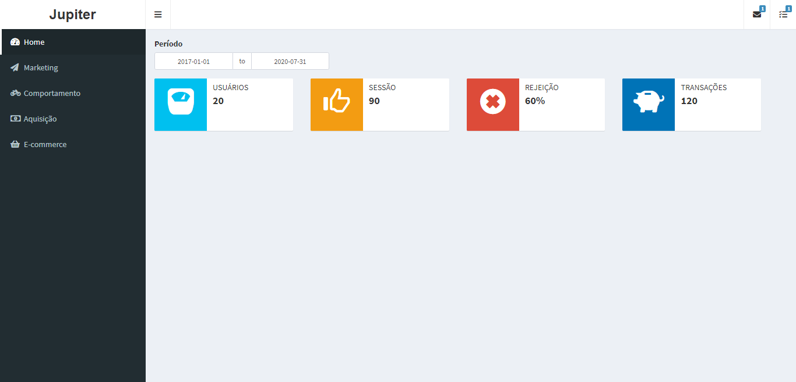

<h1 align="center">
    
</h1>

## Sobre o Projeto jupiter

Unifica dados de publicidade e vendas digitais. O sistema é construido sobre a linguagem **R** e o framework **Shiny**. 

## Objetivos

Obter mais acessibilidades sobre os dados de publicidade, definir como analisar as métricas importantes para o negócio. Além de autonomia sobre aplicação de modelos de aprendizagem de máquinas.  

## Dados Obtidos

* Google Analytics
* ~~Google Ads~~ 
* ~~Search Console~~ 

## Bibliotecas utilizadas 

[GoogleAnalytics](https://code.markedmondson.me/googleAnalyticsR/) 
[Shiny](https://shiny.rstudio.com/tutorial/) 
[Brightdashboard](https://github.com/rstudio/shinydashboard)

## Autor

 

## Licença

Este projeto esta sobe a licença [GPL V2](./LICENSE).

Feito com ❤️ por Clayton Silva[Entre em contato!](https://www.linkedin.com/in/clayttonsilva/)
